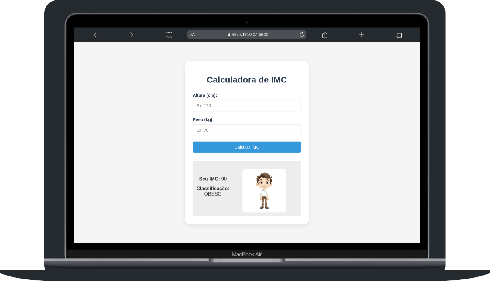

# 🧪 Desafio 01 — Calculadora de IMC

Este é o primeiro desafio da **Semana de Testes Técnicos**, com foco em HTML, CSS, JavaScript, Git e GitHub.

Neste projeto, criamos uma **Calculadora de IMC** com validações, mensagens personalizadas e renderização de imagem de acordo com o resultado.

### 📘 O que é o IMC?

O Índice de Massa Corporal (IMC) é um cálculo utilizado para avaliar se uma pessoa está com o peso ideal, em relação à sua altura.

Voçê vai desenvolver Uma aplicação que calcula o IMC (Índice de Massa Corporal) é uma ferramenta interativa onde o usuário insere seu peso (em kg) e sua altura (em metros). Ao clicar em "Calcular", a aplicação realiza a fórmula:

```js
IMC = peso / (altura * altura);
```

---

## 🚀 Tecnologias Obrigatórias

- HTML5
- CSS3
- JavaScript puro (ES6+)
- Git e GitHub

---

## 🎯 Objetivos do Desafio

- Capturar dados do usuário via formulário (peso e altura)
- Validar entradas (valores positivos e numéricos)
- Calcular o IMC e classificar o resultado
- Exibir mensagem + imagem conforme o tipo físico
- Organizar o projeto com HTML, CSS e JS separados
- Versão controlada com Git e publicada no GitHub Pages

---

## 📁 Estrutura do Projeto

```

├── index.html
├── css/
│ └── styles.css
├── js/
│ └── app.js
└── assets/
  ├── magro.png
  ├── normal.png
  └── obeso.png

```

## 🧪 Testes Manuais

| Teste | Peso | Altura | Resultado Esperado   | Imagem Esperada |
| ----- | ---- | ------ | -------------------- | --------------- |
| CT01  | 50   | 1.70   | IMC 17.3 - Magreza   | magro.png       |
| CT02  | 65   | 1.70   | IMC 22.5 - Normal    | normal.png      |
| CT03  | 95   | 1.70   | IMC 32.9 - Obesidade | obeso.png       |

---

## 🌐 Deploy no GitHub Pages, Vercel ou Netlify

## 🧠 Lições do Desafio

- Manipulação do DOM na prática
- Validação de formulários
- Uso de estruturas condicionais
- Separação de responsabilidades (HTML, CSS, JS)
- Organização de pastas
- Controle de versão com Git
- Deploy

---

## 💻 Como Executar Localmente

```bash
# 1. Abra o terminal (CMD, Powershell ou git)!

# 2. Navega até uma pasta do seu computador onde o repositório vai ficar após a clonagem!
cd nome_da_pasta

# 2. Clone o repositório
git clone https://github.com/gabriel-corto/body-js.git

# 3. Verifique se a pasta criou
ls (isso vai listar todas as pastas)

# 4. Navega até a pasta criada após a clonagem
cd pasta_criada_apos_clonagem
```

## Layout



## Cores

- Botão `#3498BD`
- Cor do app `#333333`
- Fundo do app `#F5F5F5`

- Cor do Título `#2C3E50`
- Caixa da Imagem `#FFFFFF`
- Botão com Hover `#2980B9`
- Caixa de Resultado `#EDEDED`

- Quando a Classificação for NORMAL: `#2ECC71`
- Quando a Classificação for OBESIDADE: `#E74C3C`
- Quando a Classificação for ABAIXO DO PESO: `#3498DB`
